# CAS+COW State Engine - System Design Document

## Executive Summary

The CAS+COW State Engine is a high-performance state management system designed specifically for the Oppie MVP, enabling sub-second MCTS (Monte Carlo Tree Search) main loop execution within micro-VMs. This system implements a Content-Addressable Storage (CAS) layer with Copy-on-Write (COW) semantics, providing not just state storage but real-time state change insights to drive the MCTS learning flywheel.

## System Architecture

### High-Level Architecture

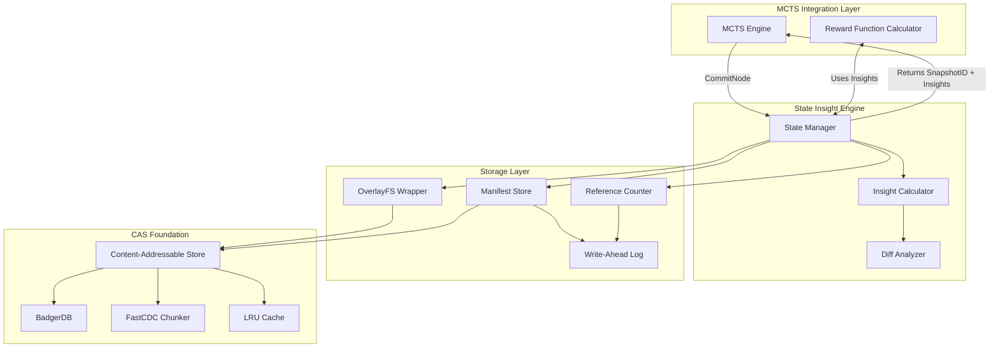

### Component Architecture

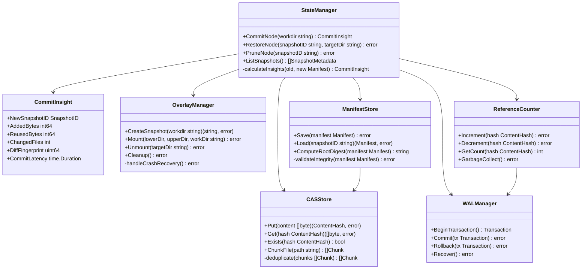

## Core Components

### 1. State Manager (The Orchestrator)

The State Manager is the primary interface that coordinates all state operations and generates insights for the MCTS engine.

#### Key Responsibilities:
- **State Commits**: Atomically commit working directory states with insight generation
- **State Restoration**: Efficiently restore previous states using COW mechanisms
- **Insight Generation**: Calculate state change metrics in < 5ms
- **Lifecycle Management**: Handle snapshot creation, restoration, and pruning

#### Interface Definition:

```go
type StateManager interface {
    // Core Operations
    CommitNode(workdir string) (CommitInsight, error)
    RestoreNode(snapshotID SnapshotID, targetDir string) error
    PruneNode(snapshotID SnapshotID) error
    
    // Query Operations
    ListSnapshots() ([]SnapshotMetadata, error)
    GetSnapshotInfo(snapshotID SnapshotID) (SnapshotInfo, error)
    
    // Maintenance
    GarbageCollect() error
    ValidateIntegrity() error
}

type CommitInsight struct {
    NewSnapshotID   SnapshotID
    AddedBytes      int64      // New code/data size
    ReusedBytes     int64      // Reused from existing snapshots
    ChangedFiles    int        // Number of modified files
    DiffFingerprint uint64     // Quick comparison hash
    CommitLatency   time.Duration
    ParentID        SnapshotID // Lineage tracking
}
```

### 2. OverlayFS Wrapper (The COW Engine)

Provides robust, crash-safe overlay filesystem operations optimized for micro-VM environments.

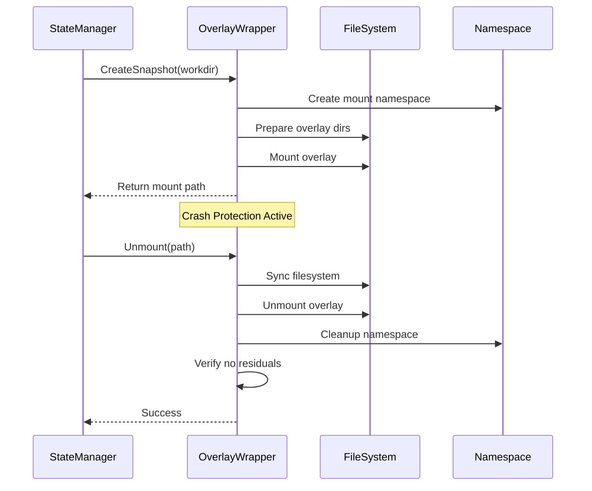

#### Key Features:
- **Atomic Operations**: All mount/unmount operations are atomic
- **Crash Recovery**: Automatic cleanup of orphaned mounts after crashes
- **Performance**: P99 < 20ms for snapshot operations
- **Namespace Isolation**: Each snapshot in isolated mount namespace

### 3. Content-Addressable Storage (The Deduplication Layer)

Implements content-based addressing with aggressive deduplication using FastCDC chunking.

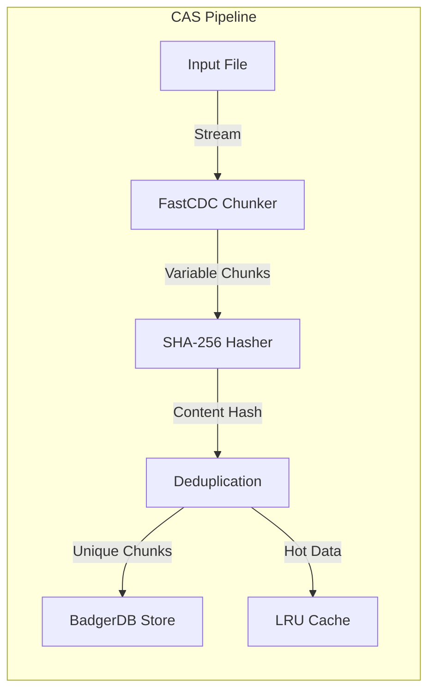

#### Storage Strategy:
- **Chunking**: FastCDC with 4KB min, 16KB average, 64KB max chunks
- **Hashing**: SHA-256 for content addressing
- **Storage**: BadgerDB for persistent key-value storage
- **Caching**: 256MB LRU cache for hot chunks
- **Compression**: Optional LZ4 for cold data

### 4. Manifest & Reference Management

Tracks file-to-chunk mappings and maintains reference counts for garbage collection.

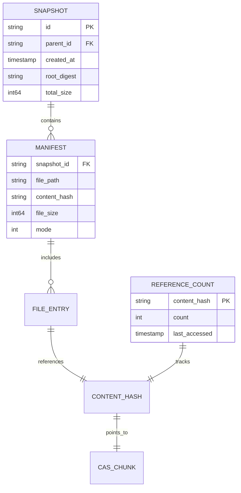

### 5. Write-Ahead Log (The Safety Net)

Ensures atomicity and crash recovery for all metadata operations.

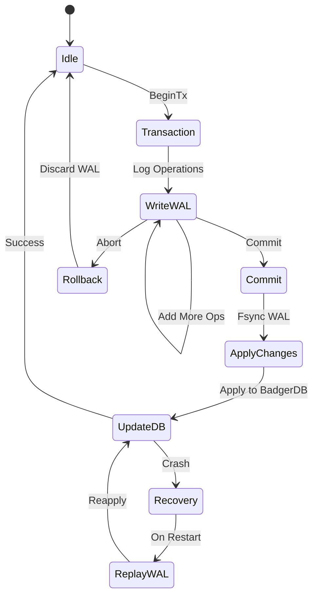

#### WAL Format:
```
[Header: 8 bytes]
[Transaction ID: 16 bytes]
[Operation Count: 4 bytes]
[Operations...]
  - OpType: 1 byte (COMMIT/PRUNE/REFCOUNT)
  - DataLength: 4 bytes
  - Data: Variable
[Checksum: 4 bytes]
```

## Performance Characteristics

### Target Metrics

| Operation | P50 Latency | P99 Latency | Throughput |
|-----------|------------|-------------|------------|
| CommitNode | 3ms | 5ms | 200 ops/s |
| RestoreNode | 15ms | 50ms | 50 ops/s |
| CreateSnapshot | 10ms | 20ms | 100 ops/s |
| Insight Calculation | 1ms | 5ms | 1000 ops/s |
| CAS Put (16KB chunk) | 0.5ms | 2ms | 2000 ops/s |
| CAS Get (cached) | 0.1ms | 0.5ms | 10000 ops/s |

### Memory Budget

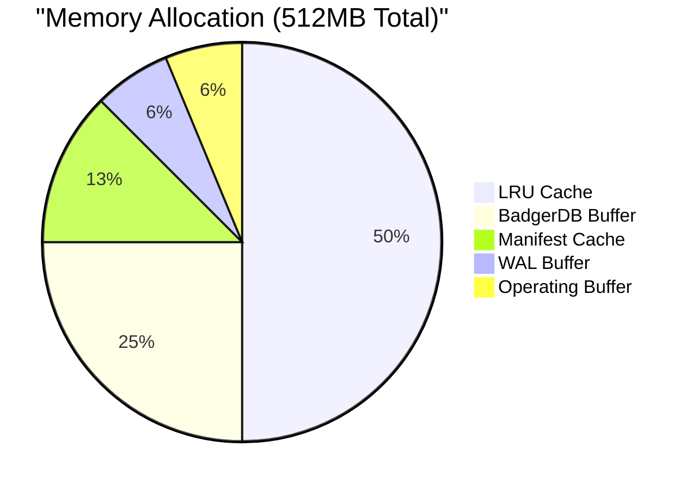

## Implementation Phases

### Phase 1: Minimum Viable Kernel (4 days)

```mermaid
gantt
    title Phase 1: Core Foundation
    dateFormat  DD
    
    section Environment
    Micro-VM Setup          :01, 0.5d
    
    section CAS Core
    ContentHash Interface   :01, 0.5d
    BadgerStore Impl       :02, 1d
    FastCDC Integration    :02, 0.5d
    
    section OverlayFS
    Mount/Unmount Core     :03, 1d
    Crash Recovery         :04, 1d
```

**Deliverables:**
- Functional micro-VM environment with OverlayFS support
- Thread-safe CAS with > 90% test coverage
- Robust OverlayFS wrapper passing 1000-cycle chaos tests

### Phase 2: Consistency & Atomicity (3 days)

```mermaid
gantt
    title Phase 2: Reliability Layer
    dateFormat  DD
    
    section Manifest
    Manifest Model         :01, 1d
    Root Digest Calc       :01, 0.5d
    
    section WAL
    WAL Format Design      :02, 0.5d
    Transaction Manager    :02, 1d
    
    section RefCount
    Reference Counter      :03, 1d
    Crash Recovery         :03, 0.5d
```

**Deliverables:**
- Manifest system with integrity verification
- WAL-backed atomic operations
- Crash-recoverable reference counting

### Phase 3: Flywheel Accelerator (3 days)

```mermaid
gantt
    title Phase 3: Intelligence Layer
    dateFormat  DD
    
    section Interface
    StateManager API       :01, 1d
    
    section Insights
    Diff Calculator        :02, 1d
    Metric Computation     :02, 1d
    
    section Performance
    Optimization          :03, 1d
```

**Deliverables:**
- Enhanced StateManager returning CommitInsight
- Sub-5ms insight generation
- Direct MCTS integration points

### Phase 4: Integration & Hardening (2 days)

```mermaid
gantt
    title Phase 4: Production Ready
    dateFormat  DD
    
    section Integration
    MCTS Connection        :01, 1d
    
    section Testing
    Stress Testing         :02, 0.5d
    Performance Validation :02, 0.5d
```

**Deliverables:**
- Full MCTS integration with reward function updates
- Multi-hour stress test passing
- Performance benchmarks meeting all P99 targets

## Critical Implementation Details

### 1. OverlayFS Mount Management

```go
type OverlayManager struct {
    mountNS     *os.File
    activeMounts map[string]*MountInfo
    cleanupChan chan struct{}
}

func (om *OverlayManager) Mount(lower, upper, work, target string) error {
    // 1. Enter new mount namespace
    // 2. Prepare directories with proper permissions
    // 3. Execute mount syscall with retry logic
    // 4. Register mount for tracking
    // 5. Setup automatic cleanup on process exit
}

func (om *OverlayManager) crashRecovery() {
    // Scan /proc/mounts for orphaned overlays
    // Attempt graceful unmount
    // Force cleanup if necessary
    // Remove stale work directories
}
```

### 2. High-Performance Diff Calculation

```go
func calculateDiff(oldManifest, newManifest Manifest) CommitInsight {
    oldMap := oldManifest.ToMap() // O(n) preprocessing
    
    var added, reused int64
    var changed int
    
    // Single pass through new manifest - O(n)
    for path, newHash := range newManifest {
        if oldHash, exists := oldMap[path]; exists {
            if oldHash != newHash {
                changed++
                // Track chunk-level reuse
            } else {
                reused += getChunkSize(newHash)
            }
        } else {
            added += getChunkSize(newHash)
            changed++
        }
    }
    
    // Compute diff fingerprint using xxHash for speed
    fingerprint := xxhash.Sum64(serialize(changed_paths))
    
    return CommitInsight{
        AddedBytes: added,
        ReusedBytes: reused,
        ChangedFiles: changed,
        DiffFingerprint: fingerprint,
    }
}
```

### 3. Atomic Reference Counting

```go
type RefCounter struct {
    db  *badger.DB
    wal *WALManager
}

func (rc *RefCounter) UpdateRefs(increments, decrements []ContentHash) error {
    tx := rc.wal.BeginTransaction()
    defer tx.Rollback()
    
    // Log all operations to WAL first
    for _, hash := range increments {
        tx.LogOp(OpIncRef, hash)
    }
    for _, hash := range decrements {
        tx.LogOp(OpDecRef, hash)
    }
    
    // Commit WAL (fsync)
    if err := tx.Commit(); err != nil {
        return err
    }
    
    // Apply to BadgerDB
    return rc.applyRefChanges(increments, decrements)
}
```

### 4. MCTS Integration Point

```go
// In MCTS Engine
func (mcts *Engine) executeRollout(node *Node) float64 {
    // Execute agent action in working directory
    workDir := mcts.prepareWorkDir(node)
    mcts.agent.Execute(workDir)
    
    // Commit state and get insights
    insight, err := mcts.stateManager.CommitNode(workDir)
    if err != nil {
        return -1.0
    }
    
    // Calculate reward using insights
    reward := mcts.baseReward
    reward -= float64(insight.AddedBytes) * 0.01  // Penalize code bloat
    reward += float64(insight.ReusedBytes) * 0.005 // Reward reuse
    reward -= float64(insight.ChangedFiles) * 0.1  // Penalize excessive changes
    
    // Update node with snapshot ID for future restoration
    node.SnapshotID = insight.NewSnapshotID
    
    return reward
}
```

## Security & Reliability Considerations

### Security Measures

1. **Input Validation**
   - Path traversal prevention in all file operations
   - Content hash verification before storage
   - Manifest integrity checking via root digest

2. **Resource Limits**
   - Maximum snapshot size enforcement
   - Rate limiting on commit operations
   - Memory bounds on cache sizes

3. **Isolation**
   - Mount namespace isolation per snapshot
   - Capability dropping after mount operations
   - Seccomp filters for syscall restrictions

### Reliability Guarantees

1. **Crash Consistency**
   - WAL ensures no partial writes
   - Reference counts always consistent
   - Automatic recovery on restart

2. **Data Integrity**
   - Content addressing prevents corruption
   - Manifest checksums detect tampering
   - Periodic scrubbing of stored chunks

3. **Performance Degradation**
   - Graceful handling of cache misses
   - Automatic GC triggers on space pressure
   - Backpressure mechanisms for overload

## Monitoring & Observability

### Key Metrics

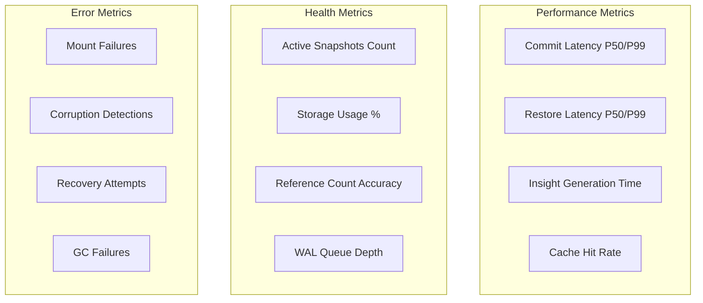

### Logging Strategy

- **Structured Logging**: JSON format with correlation IDs
- **Log Levels**: DEBUG (dev), INFO (production), ERROR (always)
- **Sensitive Data**: No file contents or paths in logs
- **Rotation**: 100MB files, 7-day retention

## Testing Strategy

### Unit Testing (Target: 90% Coverage)

- **CAS Layer**: Content addressing, chunking, deduplication
- **Manifest Operations**: CRUD, integrity verification
- **Reference Counting**: Increment, decrement, GC
- **WAL**: Transaction commit, rollback, recovery

### Integration Testing (Target: 80% Coverage)

- **End-to-end Workflows**: Commit → Restore → Prune cycles
- **Crash Recovery**: Kill -9 during operations
- **Concurrent Operations**: Multiple commits/restores
- **Performance**: Benchmark against target metrics

### Chaos Testing

```bash
# Chaos test script
for i in {1..1000}; do
    # Random operations
    op=$((RANDOM % 3))
    case $op in
        0) commit_random_state ;;
        1) restore_random_snapshot ;;
        2) kill -9 $PID && restart ;;
    esac
    
    # Verify invariants
    check_no_orphan_mounts
    check_reference_consistency
    check_storage_integrity
done
```

## Deployment Considerations

### Container/VM Requirements

- **Kernel**: Linux 5.10+ with OverlayFS support
- **Capabilities**: CAP_SYS_ADMIN for mount operations
- **Storage**: 10GB minimum, SSD recommended
- **Memory**: 512MB minimum, 1GB recommended

### Configuration Parameters

```yaml
cas:
  chunk_size:
    min: 4096
    avg: 16384
    max: 65536
  cache_size_mb: 256
  compression: lz4

overlayfs:
  mount_timeout_ms: 5000
  cleanup_interval_s: 60
  max_concurrent_mounts: 10

wal:
  buffer_size_mb: 32
  sync_interval_ms: 100
  max_transaction_size_mb: 10

gc:
  interval_minutes: 30
  min_age_hours: 1
  batch_size: 100
```

## Conclusion

The CAS+COW State Engine represents a paradigm shift from passive state storage to an active participant in the MCTS learning process. By providing sub-5ms insights on every state change, it enables the Oppie system to make more informed decisions faster, accelerating the entire learning flywheel.

The architecture prioritizes:
1. **Performance**: Meeting aggressive latency targets for MCTS integration
2. **Reliability**: Crash-safe operations with automatic recovery
3. **Intelligence**: Real-time insights beyond simple storage
4. **Efficiency**: Aggressive deduplication and caching

This design enables Oppie to evolve from a "code-writing tool" to an intelligent engineering partner with deep awareness of code evolution patterns and costs.